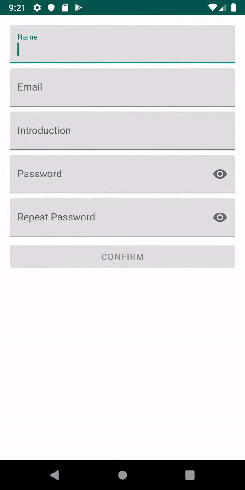

# AndroidEasyForm

In many cases, form verification is required, such as membership screen, login screen, and post upload screen. Forms can require multiple to dozens of different forms, which further complicates the verification logic.

EasyForm is designed to be DataBinding friendly.

**This project offers a way to make managing such form verification any bit easier. And it's easy to customize to meet the needs of each developer.**


## Caution!

It's just close to a personal suggestion. So, each version update can have major changes. 

Fix the library version as much as possible, and be sure to read the readme file when updating.

**Do not include complex or heavy logic in the each validator. The operating performance of the form has not been verified yet.**

**You will change your environment to under written if you weren't same with it.**

- **Android X migrated** project
- **Kotlin based** project
- **DataBinding used** project

## Importing Library

**Step 1.** Add the JitPack repository to your build file

Add it in your root build.gradle at the end of repositories:

```gradle
allprojects {
	repositories {
		...
		maven { url 'https://jitpack.io' }
	}
}
```

**Step 2.** Add the dependency

```gradle
dependencies {
	implementation 'com.github.gomsang:AndroidEasyForm:0.0.3'
}
```


## How to apply

### Construct your form

First, Create a class that inherits the EasyForm class. 

```kotlin
class RegistrationForm : EasyForm() {
}
```

Add the input fields like this.

```kotlin
class RegistrationForm : EasyForm() {
    val name = registField(EasyField<String>())
}
```

This is just adding an empty field. Now add the Validator you want to use.

**The Validator in the EasyLab class is some of the validators we have presented. How to create your own Validator is described below.**

The validate function is to add each validator sequentially to the field. In other words, each validator is validated in sequence. If the previous validator fails, the next validation is not performed.

```kotlin
class RegistrationForm : EasyForm() {
    val name = registField(EasyField<String>().apply{
        validate(EasyLab.TextEmptyValidator(), R.string.message_warn_registration_name_empty)
    })
}
```

### Attach to your view

In your xml side, set class you just created as variable. (Only available for projects that use data binding)

```xml
<data>    
	<variable
		name="form"
		type="com.gomsang.androideasyform.basicregistration.RegistrationForm"/>
</data>
```

And attach your field like this. Note the "android:text" part.

**Remember to set the argument in 2-way binding format.**

```xml
<EditText    
	android:id="@+id/nameEditText"
	android:layout_width="match_parent"
	android:layout_height="wrap_content"
	android:hint="Name"
	android:text="@={form.name}" />
```

Set the part that needs verification result as below. (E.g. OK button),  Note the "android:enabled" part.

```xml
<Button
	android:layout_width="match_parent"
	android:layout_height="wrap_content"
	android:enabled="@{form.isValidate()}"
	android:text="REGIST" />
```

Finally, create a form class and apply it to your view. (In your kotlin class)

```kotlin
// create form & apply to view
val form = RegistrationForm()
binding.form = form
```

**In a typical project, if set as above, the button cannot be pressed unless it passes the verification.**


**When you need to validate multiple forms, you can construct a form class like this.**

```kotlin
class RegistrationForm : EasyForm() {
    val name = registField(EasyField<String>().apply {
        validate(EasyLab.TextEmptyValidator(), R.string.message_warn_registration_name_empty)
    })

    val email = registField(EasyField<String>()).apply {
        validate(EasyLab.TextEmptyValidator(), R.string.message_warn_registration_email_empty)
        validate(EasyLab.EmailValidator(), R.string.message_warn_registration_email_email)
    }

    val introduction = registField(EasyField<String>().apply {
        validate(
            EasyLab.TextEmptyValidator(),
            R.string.message_warn_registration_introduction_empty
        )
    })

    val password = registField(EasyField<String>().apply {
        validate(EasyLab.TextEmptyValidator(), R.string.message_warn_registration_password_empty)
        validate(
            EasyLab.TextLengthValidator(4, 12),
            R.string.message_warn_registration_password_length
        )
    })

    val passwordRepeat = registField(EasyField<String>().apply {
        validate(
            EasyLab.TextEmptyValidator(),
            R.string.message_warn_registration_password_check_empty
        )
        validate(
            EasyLab.TextSameValidator(password, this),
            R.string.message_warn_registration_password_check_not_same
        )
    })
}
```


## How to create your own Validator

Inherit the EasyValidator class and write your validate logic.

```kotlin
class OwnValidator : EasyValidator<String> {
    override fun isValid(value: String): Boolean {
        // write your validate logic here.
    }
}
```

If it's simple enough not to create any classes, you can do the following:

```kotlin
val name = registField(EasyField<String>().apply {
    validate({ 
        if (it.isNullOrEmpty()) false else true
    }, "Input your name, please.")
})
```


## Pre-Created Validators

Some frequently used validators are provided in the EasyLab class.

```kotlin
EasyLab.TextEmptyValidator()
EasyLab.EmailValidator()
EasyLab.TextLengthValidator(minlength, maxlength)
EasyLab.TextSameValidator(first-form, twin-form /*Usually this field should be the field where the validator is applied.*/)
```


## To manage required input

By default, all EasyFields have a required input value of true. However, it may be necessary to change the required input. (e.g., getting additional information for a particular job) This library provides an alternative for this case.

**If you set this up, it will be a mandatory field for only those with the name abc.**

```kotlin
val name = registField(EasyField<String>().apply {
    validate(EasyLab.TextEmptyValidator(), R.string.message_warn_registration_name_empty)
})

val test = registField(EasyField<String>()).apply {
    required = {
        if (name.get() == "abc") true else false
    }
}
```


## Using with LiveData

The EasyForm can be used with LiveData. **This means that it is compatible with LiveData's specialized features, such as maintaining input values when rotating the screen.**

In your ViewModel class, Set up MutableLiveData to manage your classes.

```kotlin
class BasicRegistrationViewModel : ViewModel() {
    val formLiveData = MutableLiveData<RegistrationForm>()
}
```

and observe your LiveData, and set as your form in binding.

```kotlin
// getting view model.
val viewModel = ViewModelProviders.of(this).get(BasicRegistrationViewModel::class.java)

// setting live data.
viewModel.formLiveData.observe(this, Observer {
	it?.let {
		binding.form = it
	}
})

if (viewModel.formLiveData.value == null) 
	viewModel.formLiveData.value = RegistrationForm()
```


## How to show error message dynamically

### Construct with Plain TextView

If you want show your message to any textview dynamically, just set like this.

```xml
<TextView
	android:layout_width="match_parent"
	android:layout_height="wrap_content"
	android:text="@{form.errorMessage}" />
```

**If you want to display error messages for each field, set it as follows:**

1. Set error message variable like this. (All EasyField has error message variable like this.)

   ```kotlin
   class RegistrationForm : EasyForm() {
       val name = registField(EasyField<String>().apply {
           validate(EasyLab.TextEmptyValidator(), "Input your name, please.")
       })
       val nameError = name.errorMessage
       ...
   }
   ```

2. Set error message variable as textview text.

   ```xml
   <TextView
   	android:layout_width="match_parent"
   	android:layout_height="wrap_content"
   	android:text="@{form.nameError}" />
   ```

### Construct with Google Material TextInputLayout



Set error message variable like this. (All EasyField has error message variable like this.)

```kotlin
class RegistrationForm : EasyForm() {
    val name = registField(EasyField<String>().apply {
        validate(EasyLab.TextEmptyValidator(), R.string.message_warn_registration_name_empty)
    })
    val nameError = name.errorMessage
```

Construct BindingAdapter like this.

```kotlin
object ErrorBindingAdapter {
    @JvmStatic
    @BindingAdapter("app:errorText")
    fun setErrorMessage(view: TextInputLayout, errorMessage: Int?) {
        if (errorMessage == null){
            view.error = null
        }else{
            view.error = view.context.getString(errorMessage)
        }
    }
}
```

Just set TextInputLayout like this. Note the "app:errorText" part.

```xml
<com.google.android.material.textfield.TextInputLayout
	android:layout_width="match_parent"
	android:layout_height="wrap_content"
	android:hint="Name"
	app:errorText="@{form.nameError}">
	<com.google.android.material.textfield.TextInputEditText
		android:layout_width="match_parent"
		android:layout_height="wrap_content"
		android:text="@={form.name}" />
</com.google.android.material.textfield.TextInputLayout>
```
